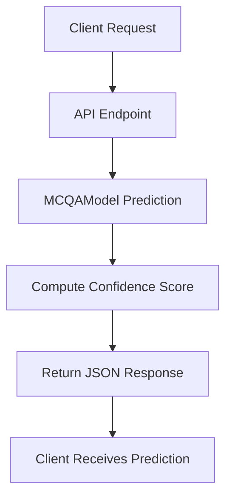

# Multiple-Choice Question Answering (MCQA) 
## REST API – Coveo NLP Challenge


> PROPRIETARY and CONFIDENTIAL, Coveo Solutions Inc. | 
> **Multiple-Choice Question Answering (MCQA) REST API** | 
> v0.1.0 - Last Edited 2025-10-02. |
> Fills in `[BLANK]` in text passages using a pre-trained HuggingFace transformer model.

---

## Table of Contents

1. [Overview](#overview)  
2. [Project Structure](#project-structure)  
3. [Quick Start Guide](#quick-start-guide)  
4. [Setup & Installation](#setup--installation)  
5. [Docker Usage](#docker-usage)  
6. [API Endpoints](#api-endpoints)  
7. [MLflow Integration](#mlflow-integration)
8. [Best Practices](#best-practices)
9. [Mermaid Application Flow Diagram](#mermaid-application-flow-diagram)   

---

## Overview

This project provides a **REST API** to serve a pre-trained MCQA transformer model.  

**Key Features:**  
- Single and batch inference for MCQA tasks.  
- `[BLANK]` replacement in text passages with multiple-choice options.  
- Modular, maintainable Python project structure.  
- Dockerized for reproducible deployment.  
- Optional MLflow integration for model tracking and metrics.  

The API is designed for production-ready inference.  

---

## Project Structure

```
mcqa_api/
├── app/
│   ├── main.py                 # API entrypoint
│   ├── settings.py             # App configuration/settings
│   ├── endpoints/
│   │   └── mcqa_endpoints.py   # API entrypoints
│   ├── models/
│   │   ├── mcqa_model.py       # Core MCQA model wrapper
│   │   └── model_loader.py     # MLflow one-time loader util
│   ├── schemas/
│   │   └── schemas.py          # Format schemas
│   └── utils/
│       └── logger.py           # Logging support
├── notebooks/                  # Training code
├── models/                     # Local copy of models
├── Dockerfile                  # Docker image definition
├── pyproject.toml              # Project specs (including dependencies)
├── ANALYSIS.md                 # Operational analysis
├── DESIGN.md                   # Design rationale & future improvements
├── README.md
└── .github                     # Release pipeline 
└── Makefile                   

```
---

## Quick Start Guide

### **1. Build and run using Makefile**

The Makefile automates environment setup, dependency installation, and API startup.

```bash
# Create virtual environment and install dependencies
make setup

# Start API locally
make run
```

### 2. Access the API locally/ Through Swagger UI

Once the API is running, access it via:

Swagger UI: http://localhost:8000/docs

From this point the single and batch prediction endpoints can be interacted with directly. 

Alternatively, once the service is running it can be queried from the command line using:

Single prediction example:

```bash
curl -X POST "http://localhost:8000/mcqa/predict" \
-H "Content-Type: application/json" \
-d '{"text": "The capital of France is [BLANK].", "choices": ["Paris","London","Berlin","Rome"]}'
```
Batch prediction example:

```bash
curl -X POST "http://localhost:8000/mcqa/predict_batch" \
-H "Content-Type: application/json" \
-d '[{"text": "The capital of France is [BLANK].", "choices": ["Paris","London","Berlin","Rome"]},
     {"text": "Water freezes at [BLANK] degrees Celsius.", "choices": ["0","100","50","-10"]}]'
```

---

## Setup & Installation
### Prerequisites
- Python 3.10
- [Optional] Docker / Docker Desktop if you want to run in a container locally
### 1. Clone the repository
```bash
git clone https://github.com/JWiseman-git/coveo_ml_dev_challenge.git
cd mcqa_api
```

### 2. Create a virtual environment
```bash
python -m venv venv
source venv/bin/activate   # Linux / Mac
venv\Scripts\activate      # Windows
```
### 3. Install dependencies via uv from pyproject.toml
```bash
# Install uv if not already installed
pip install uv

# Install project dependencies
uv install uv install -e . 
```
(This will install all dependencies specified in pyproject.toml in your virtual environment.)

### 4. Run API locally
For a startup which includes support capabilities like mlflow run tracking use:
```python -m app.main``` 

For a generic start up of the application only
```bash 
uvicorn main:app --reload --host 0.0.0.0 --port 8000
```

### 5. Test the API 
```bash 
curl -X POST "http://localhost:8000/mcqa/predict" \
-H "Content-Type: application/json" \
-d '{"text": "The capital of France is [BLANK].", "choices": ["Paris","London","Berlin","Rome"]}'
```
---

# Docker Usage

After ensuring your local setup has docker desktop or docker cli installed you can use the Dockerfile to build a local docker image.
Once this image is built it can be hosted on any docker registry of your choice. 

1. Build Docker image using
```bash 
docker build -t mcqa-api .
```
2. Run Docker container
docker run -p 8000:8000 mcqa-api
```bash 
docker run -p 8000:8000 mcqa-api
```
3. Access API
Open http://localhost:8000/docs to view Swagger UI.

---

# API Endpoints

| Endpoint            | Method | Description                                           |
|--------------------|--------|-------------------------------------------------------|
| /mcqa/predict       | POST   | Single prediction. Returns predicted choice and confidence score. |
| /mcqa/predict_batch | POST   | Batch prediction for multiple passages.             |

An example of single request is show below. This payload can be used directly in swagger to query the single prediction endpoint.

Request example:
```
{
  "text": "The capital of France is [BLANK].",
  "choices": ["Paris","London","Berlin","Rome"]
}
```
Response example:
```
{
  "prediction": "Paris",
  "confidence": 0.92
}
```

---

# MLflow Integration

- Model parameters, metrics, and artifacts are logged using MLflow.
- Latency per prediction is also logged.
- For the purpose of this minimal demo, logging is stored in a local directory.
- Also provided is a single use loader to log the entire model into a mlflow registry. Again, this feature is not activated for this poc. 

To run MLflow UI locally:

```
mlflow ui --backend-store-uri file:./mlruns_dev --port 5000
```

---

# Application Flow Diagram

Below is a basic flow diagram for how a client might interact with the service. 


---

# Best Practices

- Follow PEP8 for Python code style.
- Use virtual environments for reproducibility.
- Containerize with Docker for consistent deployment.
- Separate model logic from API endpoints.
- Log metrics and latency for operational observability.
- Document endpoints with Swagger.

---

# License
Proprietary – Coveo Solutions Inc.

# Contact 
Email: jordanmarkwiseman@gmail.com 
Internal: ...